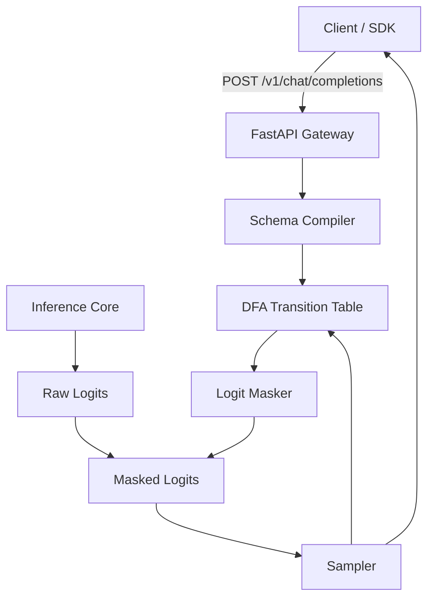

# grammar-constrained-firewall

A lightweight proxy for grammar-constrained decoding with Large Language Models.

The service compiles JSON Schemas, Pydantic models, or regular expressions into Deterministic Finite Automata (DFAs) via `interegular`. During autoregressive decoding, token logits that do not match valid state transitions are masked to `-inf`, ensuring all generated output adheres to the specified grammar on the first pass.

Exposes an OpenAI-compatible `/v1/chat/completions` interface supporting standard parameters, structured `response_format` schemas, and streaming SSE chunks.

---

## Architecture



---

## Features

- **Schema to DFA Compilation:** Converts JSON schemas, Pydantic models, enums, numbers, and nested objects into indexed DFAs.
- **Logit Masking:** Evaluates allowable token transitions per state and sets non-compliant token scores to `-inf`.
- **DFA Transition Caching:** Caches compiled state machines and state transitions to reduce per-request overhead.
- **OpenAI Compatible:** Drop-in replacement for `/v1/chat/completions`, supporting `response_format={"type": "json_schema", ...}`.
- **Streaming Support:** Emits Server-Sent Events (SSE) deltas compatible with the OpenAI streaming protocol.
- **PyTorch / Transformers Integration:** Optional `LogitsProcessor` class for use directly in HuggingFace inference pipelines.

---

## Installation

### From Source
```bash
git clone https://github.com/your-org/grammar-constrained-firewall.git
cd grammar-constrained-firewall
pip install -r requirements.txt
```

### Docker
```bash
docker compose up --build -d
```

---

## Usage

### Start Gateway
```bash
python -m uvicorn app.main:app --host 0.0.0.0 --port 8000
```

### Python (OpenAI SDK)

```python
from openai import OpenAI

client = OpenAI(base_url="http://localhost:8000/v1", api_key="not-needed")

schema = {
    "type": "object",
    "properties": {
        "invoice_id": {"type": "string"},
        "total_amount": {"type": "number"},
        "currency": {"type": "string", "enum": ["USD", "EUR", "GBP"]},
        "line_items": {
            "type": "array",
            "items": {
                "type": "object",
                "properties": {
                    "description": {"type": "string"},
                    "quantity": {"type": "integer"},
                    "unit_price": {"type": "number"},
                },
                "required": ["description", "quantity", "unit_price"],
            },
        },
    },
    "required": ["invoice_id", "total_amount", "currency", "line_items"],
}

response = client.chat.completions.create(
    model="qwen-2.5-7b-instruct",
    messages=[
        {"role": "system", "content": "Extract invoice data."},
        {"role": "user", "content": "Invoice #1042 for $320.50 USD with 2 chairs at $160.25 each."},
    ],
    response_format={
        "type": "json_schema",
        "json_schema": {
            "name": "InvoiceExtraction",
            "strict": True,
            "schema": schema,
        },
    },
    temperature=0.2,
)

print(response.choices[0].message.content)
```

### Streaming Example

```python
stream = client.chat.completions.create(
    model="qwen-2.5-7b-instruct",
    messages=[{"role": "user", "content": "Get deployment status"}],
    response_format={
        "type": "json_schema",
        "json_schema": {
            "name": "DeploymentStatus",
            "strict": True,
            "schema": {
                "type": "object",
                "properties": {
                    "status": {"type": "string", "enum": ["HEALTHY", "DEGRADED"]},
                    "replicas": {"type": "integer"},
                },
                "required": ["status", "replicas"],
            },
        },
    },
    stream=True,
)

for chunk in stream:
    token = chunk.choices[0].delta.content or ""
    print(token, end="", flush=True)
```

---

## Testing

Run test suite:
```bash
pytest tests/ -v
```

Run A/B benchmark comparing unconstrained generation against constrained masking:
```bash
python benchmarks/benchmark_runner.py --iterations 1000 --workers 8
```

---

## Configuration

Environment variables can be configured in `.env` or passed via Docker:

| Variable | Default | Description |
| :--- | :--- | :--- |
| `MODEL_ID` | `qwen-2.5-7b-instruct` | Target model identifier |
| `PORT` | `8000` | Port for the HTTP proxy |
| `HOST` | `0.0.0.0` | Bind host address |
| `FSM_CACHE_SIZE` | `256` | Maximum number of compiled DFAs cached in LRU memory |
| `LOG_LEVEL` | `INFO` | Logging level (`DEBUG`, `INFO`, `WARNING`, `ERROR`) |
| `ENABLE_METRICS` | `true` | Expose metrics at `/metrics` |

---

## License
Apache-2.0
